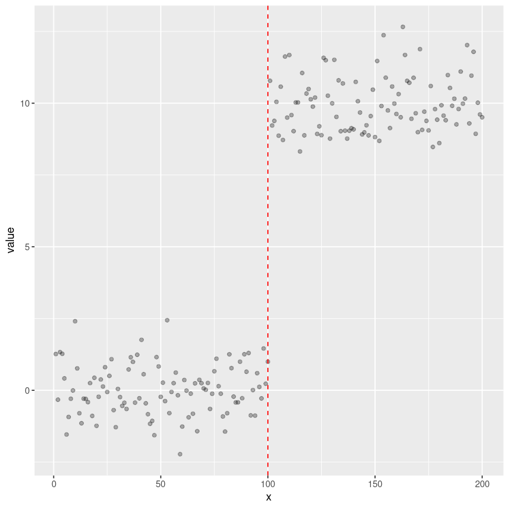
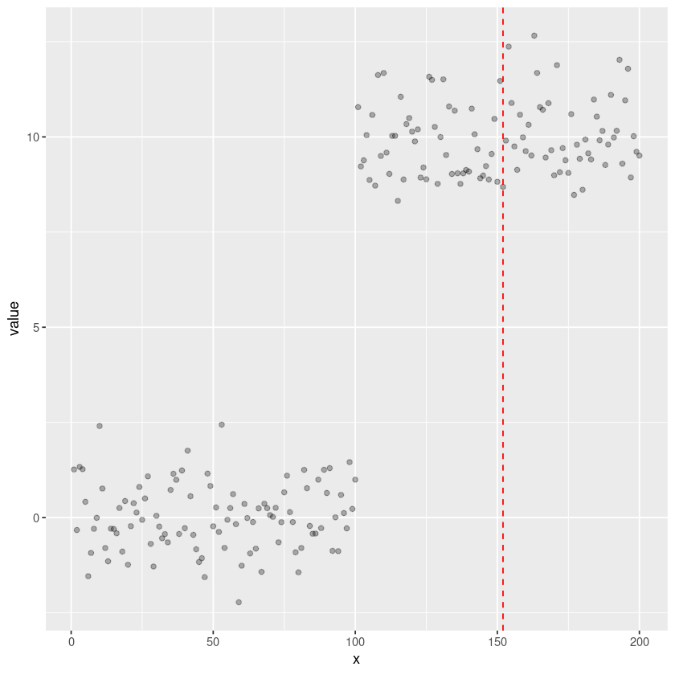

# Installing and using changepoint.np version 2.0.0

## Install devtools to install changepoint.np from github


```R
if(!require("devtools"))
{
    install.packages("devtools")      
}
library(devtools)
```

    Loading required package: devtools
    
    Loading required package: usethis
    


## Remove existing versions of changepoint.np and replace with version 2.0.0


```R
if(system.file(package='changepoint.np') != '')
{
    remove.packages("changepoint.np")
}
install_github("grosed/changepoint.np@2.0.0")
```

    Downloading GitHub repo grosed/changepoint.np@2.0.0
    


    
    ── R CMD build ────────────────────────────────────────────────────────────────────────────────────────────────────────────────────────────────────────────────────
    ✔  checking for file ‘/tmp/RtmpgpXvf6/remotes1543c5c1f3b89/grosed-changepoint.np-f9e6173/DESCRIPTION’
    ─  preparing ‘changepoint.np’:
    ✔  checking DESCRIPTION meta-information
    ─  cleaning src
    ─  checking for LF line-endings in source and make files and shell scripts
    ─  checking for empty or unneeded directories
         NB: this package now depends on R (>= 3.5.0)
         WARNING: Added dependency on R >= 3.5.0 because serialized objects in
         serialize/load version 3 cannot be read in older versions of R.
         File(s) containing such objects:
           ‘changepoint.np/tests/testthat/test.data.RData’
    ─  building ‘changepoint.np_2.0.0.tar.gz’
       
    

    Installing package into ‘/home/grosedj/work/changed-env/R-packages’
    (as ‘lib’ is unspecified)
    


## Load the changepoint.np package


```R
library(changepoint.np)
```

## Generate some test data


```R
set.seed(0)
data <- c(rnorm(100,0,1),rnorm(100,10,1))
```

## Create some quantiles from the data


```R
qnts <- quantiles(data,40)
```

## Analyse data using the "average" method


```R
penalty <- 4*log(length(data))
results.np.average <- cpt.np.average(data,qnts,penalty)
```


```R
summary(results.np.average)
```

    changepoint detection using non parametric cost function (average method)
    penalty = 21.19327
    changepoint locations are
      start end     cost
    1     1 100 196.5320
    2   101 200 207.9924
    using 40 quantiles located at 
     [1]        -Inf -2.22390027 -2.22390027 -1.56378205 -1.56378205 -1.53995004
     [7] -1.53995004 -1.43758624 -1.28459935 -1.23753842 -1.14765701 -0.92856703
    [13] -0.83204330 -0.69095384 -0.42481028 -0.27934628 -0.05487747  0.25014132
    [19]  0.66413570  1.25601882  8.81950932  9.07102892  9.49930340  9.79381100
    [25] 10.02747534 10.33561721 10.68937270 10.79791644 11.05375086 11.49781876
    [31] 11.58009168 11.67829721 11.79048505 11.88318254 11.88318254 12.02476139
    [37] 12.02476139 12.36971991 12.36971991         Inf


```R
cpts.np.average <- changepoints(results.np.average)
cpts.np.average
```


<table class="dataframe">
<caption>A data.frame: 2 × 3</caption>
<thead>
	<tr><th scope=col>start</th><th scope=col>end</th><th scope=col>cost</th></tr>
	<tr><th scope=col>&lt;dbl&gt;</th><th scope=col>&lt;dbl&gt;</th><th scope=col>&lt;dbl&gt;</th></tr>
</thead>
<tbody>
	<tr><td>  1</td><td>100</td><td>196.5320</td></tr>
	<tr><td>101</td><td>200</td><td>207.9924</td></tr>
</tbody>
</table>


```R
plot(results.np.average)
```


    

    


```R

```

## Analyse data using the "conditional" method


```R
penalty <- 4*log(length(data))
results.np.conditional <- cpt.np.conditional(data,qnts,penalty)
```


```R
summary(results.np.conditional)
```

    changepoint detection using non parametric cost function (conditional method)
    penalty = 21.19327
    changepoint locations are
      start end     cost
    1     1 100 249.6472
    2   101 200 249.6472
    using 40 quantiles located at 
     [1]        -Inf -2.22390027 -2.22390027 -1.56378205 -1.56378205 -1.53995004
     [7] -1.53995004 -1.43758624 -1.28459935 -1.23753842 -1.14765701 -0.92856703
    [13] -0.83204330 -0.69095384 -0.42481028 -0.27934628 -0.05487747  0.25014132
    [19]  0.66413570  1.25601882  8.81950932  9.07102892  9.49930340  9.79381100
    [25] 10.02747534 10.33561721 10.68937270 10.79791644 11.05375086 11.49781876
    [31] 11.58009168 11.67829721 11.79048505 11.88318254 11.88318254 12.02476139
    [37] 12.02476139 12.36971991 12.36971991         Inf


```R
cpts.np.conditional <- changepoints(results.np.conditional)
cpts.np.conditional
```


<table class="dataframe">
<caption>A data.frame: 2 × 3</caption>
<thead>
	<tr><th scope=col>start</th><th scope=col>end</th><th scope=col>cost</th></tr>
	<tr><th scope=col>&lt;dbl&gt;</th><th scope=col>&lt;dbl&gt;</th><th scope=col>&lt;dbl&gt;</th></tr>
</thead>
<tbody>
	<tr><td>  1</td><td>100</td><td>249.6472</td></tr>
	<tr><td>101</td><td>200</td><td>249.6472</td></tr>
</tbody>
</table>


```R
plot(results.np.conditional)
```


    

    


## Analyse data using the "max" method


```R
qnts <- quantiles(data,15)
penalty <- log(length(data))
results.np.max <- cpt.np.max(data,qnts,penalty)
```


```R
summary(results.np.max)
```

    changepoint detection using non parametric cost function (maximum method)
    penalty = 5.298317
    changepoint locations are
      start end      cost
    1     1 152 200.59737
    2   153 200  61.10536
    using 15 quantiles located at 
     [1]       -Inf -2.2239003 -1.5637821 -1.4250984 -0.9406492 -0.4333103
     [7]  0.1197176  2.4413646  9.5874801 10.4947958 11.1021766 11.6802782
    [13] 12.0247614 12.3697199        Inf


```R
cpts.np.max <- changepoints(results.np.max)
cpts.np.max
```


<table class="dataframe">
<caption>A data.frame: 2 × 3</caption>
<thead>
	<tr><th scope=col>start</th><th scope=col>end</th><th scope=col>cost</th></tr>
	<tr><th scope=col>&lt;dbl&gt;</th><th scope=col>&lt;dbl&gt;</th><th scope=col>&lt;dbl&gt;</th></tr>
</thead>
<tbody>
	<tr><td>  1</td><td>152</td><td>200.59737</td></tr>
	<tr><td>153</td><td>200</td><td> 61.10536</td></tr>
</tbody>
</table>


```R
plot(results.np.max)
```


    

    

